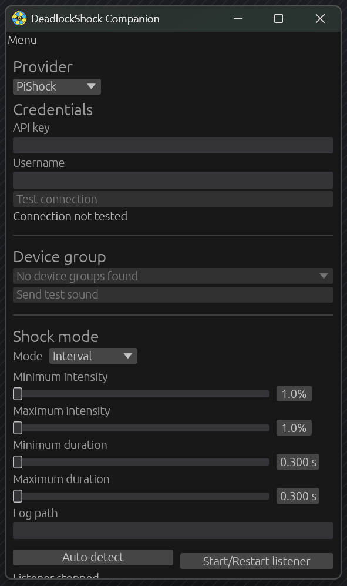

<a href="https://gamebanana.com/mods/710227"></a>

# Lovelock Companion

Lovelock Companion is a desktop app that syncs local-player deaths, kills, assists, ability uses, and cooldown readiness in Deadlock to a Buttplug.io toy.

## Required Deadlock mod

Install and enable the [Lovelock mod from GameBanana](https://gamebanana.com/mods/710227) in Deadlock before starting the companion. The mod detects gameplay events and writes them to the log that the companion listens to.

Huge shoutout to volc/bolc for creating the original [DeadlockShock mod](https://gamebanana.com/mods/700758) that Lovelock Companion is built on.

## Getting Started

Here's everything, start to finish.

**What you need:**
- [Deadlock](https://store.steampowered.com/app/1422450/Deadlock/) installed
- A [Buttplug.io toy](https://iostindex.com/)

**Depending on your provider:**
- **Lovense** — the [Lovense Connect/Remote app](https://www.lovense.com/download) on the same PC (or another device on your LAN, in which case update the domain and port to match it)
- **Intiface Central** — [Intiface Central](https://intiface.com/) running as an external server
- **Local (Embedded Intiface)** — nothing extra; the engine runs inside the companion

**Steps:**

1. **Install the Lovelock mod.** Download it from [GameBanana](https://gamebanana.com/mods/710227) and follow GameBanana's install instructions (or use a mod manager like [Grimoire Manager](https://www.grimoiremods.com/) or [Deadlock Mod Manager](https://deadlockmods.app/)) to get it into Deadlock's `addons` folder, then make sure it's enabled in the mod manager.

2. **Set Deadlock's launch option.** In Steam, right-click Deadlock → **Properties** → **General** → **Launch Options**, and add:
   ```
   -condebug
   ```
   This makes Deadlock write the log file Lovelock Companion reads from.

3. **Download and run Lovelock Companion.** Grab `companion.exe` from this repo's [Releases page](https://github.com/a55uka/lovelock/releases) and launch it.

4. **Select your provider.** In the **Setup** tab, pick one of **Lovense**, **Local (Embedded Intiface)**, or **Intiface Central**, then get it connected:
   - **Lovense:** open the Lovense Remote app, turn on **Game Mode**, and leave it running in the background. The default connection settings already work when the app is on the same PC. Click **Test connection**.
   - **Local:** click **Start embedded engine**, then **Start scanning for toys**. Stop scanning once your toys show up.
   - **Intiface:** start the server in Intiface Central (and scan for devices there), enter its WebSocket address, and click **Test connection**.

   Once connected, optionally pick a specific toy — or leave it unselected to vibrate every connected toy.

5. **Turn on your triggers.** Go to the **Effects** tab and enable whichever of Death, Kill, Assist, Ability use, and Cooldown ready you want (Death is on by default; the rest are opt-in). Adjust each trigger's vibration strength/duration to taste.

6. **Launch Deadlock and play.** Lovelock Companion auto-detects the game and starts listening on its own. Just leave the companion window open in the background.

If something's not connecting, check **Menu → Show logs** inside the companion for live diagnostics.

## Contents

- `companion/` — Lovelock Companion, the desktop app (Rust/egui). Handles setup, effects, game-log listening, and the three toy providers (Lovense, embedded, Intiface Central).
- `lovense/` — the crate the companion uses to talk to Lovense toys over the local Standard API ("Game Mode") via the Lovense Connect/Remote app.
- `mod/` — the Panorama sources for the Deadlock mod that feeds game events to the companion.
- `tests/` — integration tests for the mod/companion event bridge.

Connection settings, toy selection, and per-trigger vibration settings are all persisted in your OS user config directory.

The [DeadlockShock mod](https://gamebanana.com/mods/700758) that feeds Lovelock Companion its game events is built
and published separately ([DeadlockShock repo](https://github.com/VolcanoCookies/deadlockshock)).

## Preview

[](./media/showcase.png)

## Building from source

You will need [Rust](https://rust-lang.org/), [PowerShell](https://learn.microsoft.com/en-us/powershell/), and [Reduced CSDK 12](https://deadlockmodding.pages.dev/modding-tools/csdk-12).

```sh
cargo run --manifest-path companion/Cargo.toml --release
```

On Windows, `scripts/build_and_run.bat` builds Lovelock Companion in debug mode and launches it in one step, which is handy while iterating.
Linux builds are possible but currently take some manual effort, hopefully I will soon make it easier!

## Usage details

In **Setup**, select your provider and test the connection. The Lovense provider connects through the Remote app's domain and port; the Intiface provider connects to an external server's WebSocket address; the Local provider runs its engine in-process. Optionally pick a specific toy (leave unselected to vibrate every connected toy).

In **Effects**, configure Death, Kill, Assist, Ability use, and Cooldown ready independently. Each trigger has its own vibration profile (fixed strength/duration, or a random interval). Ability-use and cooldown-ready also have independent positional-slot filters that apply across heroes; ability names appear when the addon reports them, with numbered slots as the fallback. Use the explicit Copy control to copy only the active vibration profile between triggers without changing enablement or ability selection. Local-player death is enabled by default, while Kill, Assist, and both ability triggers are opt-in. Cooldown ready covers both a normal cooldown finishing and a charged ability restoring a charge. Kill fires from the local player's live kill-streak counter and Assist fires from the on-screen kill-assist popup, both of which update without needing the scoreboard (Tab) open.

In **Game connection**, Lovelock Companion automatically resumes a saved `console.log` path or auto-detects Deadlock and starts the listener at launch. Use **Auto-detect** and **Start/Restart listener** for diagnostics, retry, or a manual path override. Deadlock must run with `-condebug` so the log is written.
On Windows releases Lovelock Companion uses the GUI application subsystem, so launching it from Explorer does not open a command window. On Windows and Linux, open **Menu → Show logs** for selectable startup and live diagnostics. Logs are retained only in memory for the current run and are not written to a persistent log file.

Lovelock Companion remembers your setup, including the provider connection, all five vibration profiles, and ability filters, in your OS user config directory. Ability names are runtime diagnostics and are not saved.

## Publishing a release

1. Choose the release version and update `companion/Cargo.toml`.
2. Run the companion tests.
3. Push the matching tag:

```sh
git tag v<version>
git push origin v<version>
```

Drone verifies `DRONE_TAG == v<companion Cargo version>` before building and publishing the companion artifacts. The [DeadlockShock mod](https://gamebanana.com/mods/700758) is built and published separately and is not part of this release pipeline.
